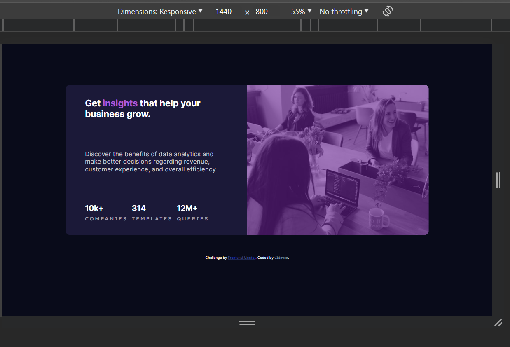
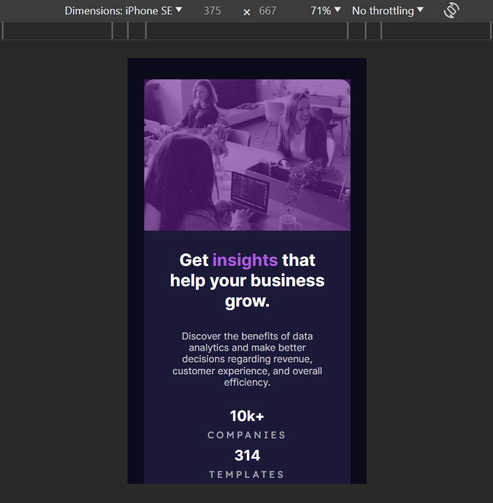

# Frontend Mentor - Stats preview card component solution

This is a solution to the [Stats preview card component challenge on Frontend Mentor](https://www.frontendmentor.io/challenges/stats-preview-card-component-8JqbgoU62). Frontend Mentor challenges help you improve your coding skills by building realistic projects. 

## Table of contents

- [Overview](#overview)
  - [The challenge](#the-challenge)
  - [Screenshot](#screenshot)
  - [Links](#links)
- [My process](#my-process)
  - [Built with](#built-with)
  - [What I learned](#what-i-learned)
  - [Continued development](#continued-development)
  - [Useful resources](#useful-resources)
- [Author](#author)


## Overview

This addresses the challenge of the [Stats preview card component challenge on Frontend Mentor], and it has been coded by clintt-09.

Two screenshots are available, showcasing the Desktop and Mobile views. Additionally, there are provided links to both the GitHub repository and the live site hosted on Netlify.

### The challenge

Users should be able to:

- View the optimal layout depending on their device's screen size

### Screenshot

Desktop view (1440 x 800)




Mobile view (375 x 667)



### Links

- Solution URL: [Solution On Frontend Mentor](https://www.frontendmentor.io/solutions/responsive-stats-preview-card-with-flexbox--CqFICVg9x)
- Live Site URL: [ace-4.netlify.app](https://ace-4.netlify.app/)

## My process

Here are the tools and technologies I employed to address this challenge, insights gained throughout the problem-solving journey, areas in which I aspire to enhance my skills in the coming days, and articles that proved beneficial for me, potentially aiding others in overcoming similar challenges on Frontend Mentor or elsewhere.

This is the approach I took to address this challenge. 

### Built with

- Semantic HTML5 markup
- CSS custom properties
- Flexbox
- Mobile-first workflow


### What I learned

I learnt how to use CSS to create color overlays on images...which was probably the most challenging thing to do in this challenge...but it wasn't hard anyway.

Here's how I did it:

```css
.hero{
    position: relative;
    width: 100%;
    border-top-right-radius: 16.1698px;
    border-top-left-radius: 16.1698px;
}

.hero::before{
    content: "";
    display: block;
    position: absolute;
    top: 0;
    left: 0;
    width: 100%;
    height: 100%;
    background-color: hsl(277, 64%, 35%);
    opacity: .6;
}
```

### Continued development

I'm getting the hang of responsive design with CSS Flexbox and Media queries. I'll definitely get there soon...

### Useful resources

- [MDN Web Docs](https://developer.mozilla.org/en-US/) - This is was a clear and concise documentation that helped me lots during this challenge. I believe every web developer is familiar with it but I still need to mention it in case.

## Author

- Frontend Mentor - [@clintt-09](https://www.frontendmentor.io/profile/clintt-09)
- Twitter - [@clinttfr](https://www.twitter.com/clinttfr)
